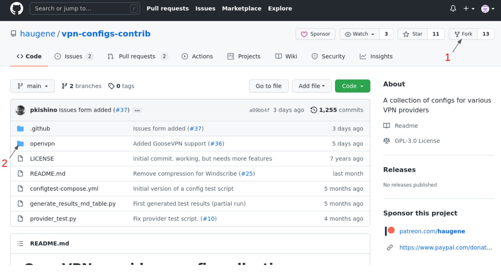
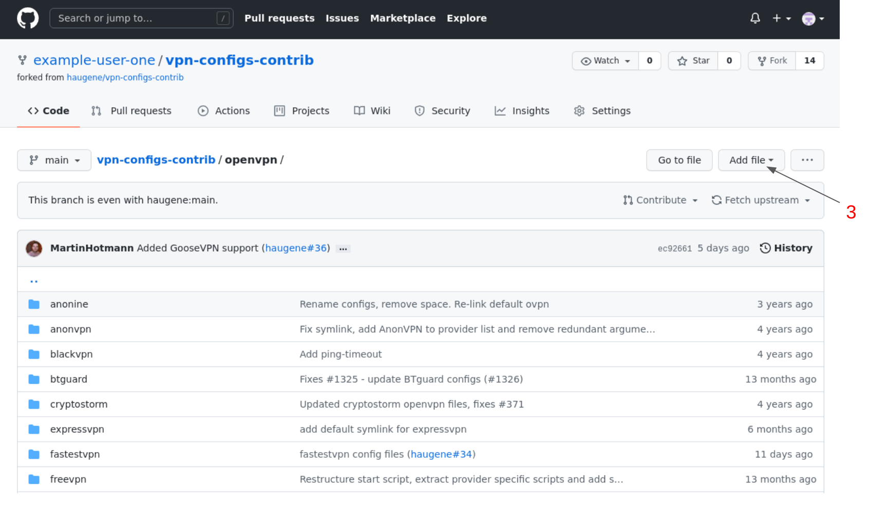
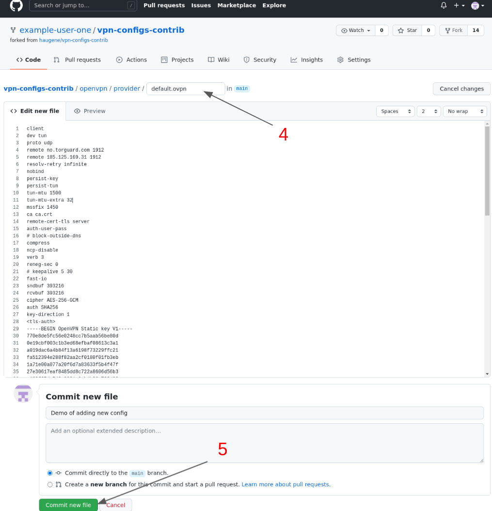

# Adding your own config files

This file is called "contributing" but it is really about using a new configuration, and a side 
effect of that when you use one of the described idioms below is that you can contribute your
config file back to the community.

Contributing to this repository means helping to keep all the config files up to date.
We're assuming that you do this because you use the Docker image `haugene/transmission-openvpn` and
you're lacking some configs or you want to update them because the provider has changed them.
All other uses of this repo is concidered "special interest" for now and will not be covered here.

Previously this was a bit more tricky because the configs lived in the main repo and you had to get your
configs into that repo to test them - and verify that they worked.
For those who are skilled at the command line and familiar with Docker you could of course build the image locally
but this project aims to make Docker accessible by those not too familiar with it as well so we wanted to make it simpler.

By separating the code itself and the configs you can actually run the official image and point it to your copy of the configs.
This way you can safely tinker along until it works and then submit a pull-request if you feel like helping out other users as well.


I'm assuming that you are able to run the image and follow the regular instructions and documentation for that.
This is steps you need to take in addition to that. So here we go.

This is the "add my own config" for dummies. Feel free to propose changes here to make it even simpler.

## Case 1: You have a config file (.ovpn) and you can publish/contribute it to the public

On the GitHub page for this config repository (assuming you're logged in):

1. Fork the repository (**wait until your fork is made**)
2. Click the "openvpn" folder of your fork



Once you have your own copy of this repository you can start editing. You should have already navigated to the `openvpn` folder
and if you're adding a new provider or just doing your own "custom" provider this is where you start.

3. Click the "Add file" button and then "Create new file"



4. Write a name for your config. It should be `<provider-name>/config.ovpn`. In this example our only goal is to run with
our own config so we write `provider/default.ovpn`. By calling the file `default.ovpn` we don't need to specify the name later.
For any provider the container will look for a file with that name if no else is given.

5. Paste the contents of your .ovpn file and press "Commit". You need to write a message describing your change.



6. Now you can configure your container to use your version of the configs by setting the `GITHUB_CONFIG_SOURCE_REPO` environment variable. In my example that would be `GITHUB_CONFIG_SOURCE_REPO=example-user-one/vpn-configs-contrib`.

7. Since I called my provider just "provider" I would have to set `OPENVPN_PROVIDER=provider`

8. If I had called the config file something other than `default.ovpn` I would have to reference that with `OPENVPN_CONFIG=config-file-name`. Note that the config-file-name should be without `.ovpn` suffix.

Good luck!

**NB:** In this example I borrowed a config file from Torguard. They have their ca certificates inlined in the config.
Some providers have their certificates and keys as separate files and just reference them in the .ovpn file.
In these cases do step 3 again and add these files as well. Keep the file names like they are in your config bundle.

## Case 2: You have one or more config files (.ovpn) and you want keep them private

Some VPN providers do not use a username-password pair to authenticate your computer to their services, but instead
embed a cryptographic key in the configuration that is unique to you. It would be inadvisable to share that key on
the internet in a publicly-accessable github repo.

Instead, you can store the ovpn file(s) *next to* your docker-compose.yaml or Dockerfile, and ask the docker system
to provide that file in a place that the configuiration system can find and understand. (You can store them
elsewhere, but you have to adjust the relative filename `./` below to refer to your chosen location.)

Since we're providing our own file, we don't need to adhere to the "OPENVPN_PROVIDER" choices in the image or in the
configuration repo and we have liberty to nominate our own provider. Let's use a name that we have confidence will
not be claimed by a future service, `-local-`, and pick names to represent the configuration names. (It is okay to
have only one!)

You should store your configuration on disk with some descriptive filename, like "AirVPN_America_UDP-443.ovpn",
which we'll need in the "volumes" configuration of docker-compose.yaml for your transmission service. This will be
marked as "your local filename". Note, the "configuration" name does not have ".ovpn" on the end, but the "file" 
name will.

You add a volume with that filename, mapping it to a configuration name inside your docker container, e.g.,

```yaml
#... inside the haugene/transmission-openvpn stanza
    volumes:
#...
      - "./AirVPN_America_UDP-443.ovpn:/config/vpn-configs-contrib/openvpn/-local-/alice-cred-airvpn-america-udp.ovpn:ro"
      - "./AirVPN_America_TDP-443.ovpn:/config/vpn-configs-contrib/openvpn/-local-/alice-crede-airvpn-america-tcp.ovpn:ro"
      - "./AirVPN_Europe_UDP-443.ovpn:/config/vpn-configs-contrib/openvpn/-local-/alice-cred-airvpn-europe-udp.ovpn:ro"
#          ^---Your local filenames-^                                             ^-----Your config names----^ ^no!
#        ^^  dot slash represents that the OpenVPN config files are in the same directory as your docker-compose.yaml 

    environment:
#...
      - "OPENVPN_PROVIDER=-local-"
#                         ^-----^  This is required to be set to construct destination filename(s) above.
      - "OPENVPN_CONFIG=alice-credential-airvpn-america-udp,alice-credential-airvpn-america-tcp,alice-credential-airvpn-europe-udp"
#                       ^----Your configuration names-----^+...
```
